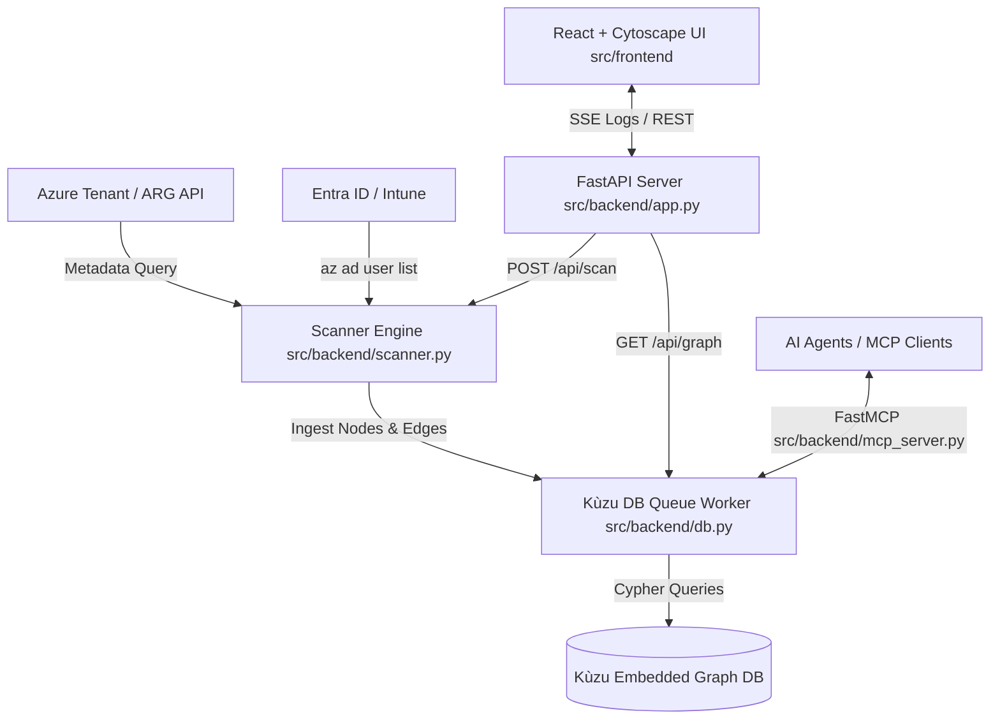

# 🛡️ Autonomous Security Graph Dashboard

An enterprise-grade, high-performance security graph visualization and investigation dashboard powered by **FastAPI**, **Kùzu Graph Database**, **Cytoscape.js**, and an embedded **Model Context Protocol (MCP) Server**.


---

## 🌟 Key Features

- **Live Cloud Asset Discovery:** Seamless integration with Azure Resource Graph (ARG) for instant discovery of Virtual Machines, Subnets, VNets, Storage Accounts, and Network Interfaces.
- **Entra ID Identity Ingestion:** High-priority extraction and paging of Entra ID user accounts (Global Admins, CISOs, SOC Analysts, Managers, active VM sessions) mapped to endpoint workloads.
- **Single-Threaded Kùzu Graph Engine:** Dedicated Python worker-thread queue architecture ensuring zero C++ lock contention or multithreading deadlocks.
- **Model Context Protocol (MCP) Server:** Native FastMCP integration (`src/backend/mcp_server.py`) enabling AI agents (e.g., Claude, Antigravity) to query blast radiuses and inspect graph schemas via Cypher.
- **Interactive Cytoscape.js GUI:** Dynamic canvas featuring Obsidian Dark aesthetic (`#111111` canvas, `#e93d82` highlights), zoom controls, node search, layout transitions, and detailed inspector drawers.
- **Security Incident Correlation:** Automatic mapping of live Defender Alerts & Sentinel Security Incidents to compromised cloud infrastructure.

---

## 🏗️ Architecture Overview



---

## 🚀 Quick Start Guide

### Prerequisites

- **Python 3.11+**
- **Node.js 18+** & `npm`
- **Azure CLI (`az`)** *(Optional for live tenant discovery)*

---

### 1. Local Development Setup

#### Backend Setup
```bash
# Clone repository
git clone https://github.com/IamVigneshk/graph-security-dashboard.git
cd graph-security-dashboard

# Create virtual environment
python3 -m venv venv
source venv/bin/activate

# Install dependencies
pip install -r requirements.txt

# Start FastAPI backend server (Runs on http://localhost:8000)
PYTHONPATH=. python src/backend/app.py
```

#### Frontend Setup
```bash
# Open a new terminal and navigate to frontend directory
cd src/frontend

# Install dependencies
npm install

# Start Vite development server (Runs on http://localhost:5173)
npm run dev
```

---

### 2. Running with Docker Compose

To launch both the backend API server and frontend build in isolated containers:

```bash
docker-compose up --build
```
Access the application at `http://localhost:8000`.

---

## 🔌 Model Context Protocol (MCP) Server Integration

The backend includes a standalone FastMCP server allowing LLMs and AI agents to query the security graph safely:

### Running the MCP Server
```bash
PYTHONPATH=. python src/backend/mcp_server.py
```

### Exposed MCP Tools

1. `get_graph_schema()`: Returns graph node types (`Machine`, `CloudResource`, `Incident`, `Alert`, `User`) and relationship schemas (`:AFFECTS`, `:HOSTED_IN`, `:LOGGED_IN_TO`, `:INCLUDES`).
2. `read_cypher_query(query)`: Executes read-only Cypher queries against the embedded Kùzu database. Write operations (`CREATE`, `DELETE`, `SET`) are strictly blocked.

#### Example MCP Cypher Query
```cypher
MATCH (i:Incident)-[:AFFECTS]->(m:Machine)-[:HOSTED_IN]->(r:CloudResource)
RETURN i.title, m.name, r.type
```

---

## 📡 API Endpoints Reference

| Method | Endpoint | Description |
| :--- | :--- | :--- |
| `GET` | `/api/health` | Healthcheck returning Kùzu engine status |
| `POST` | `/api/scan` | Triggers Azure & Defender scan via SSE log stream |
| `GET` | `/api/graph` | ReturnsCytoscape-formatted graph nodes & edges |

---

## 🎨 UI Aesthetic & Design System

- **Background:** `#111111` (Obsidian Dark)
- **Cards & Drawers:** `#191919` / `#1a1a1a` with glassmorphic borders
- **Primary Accent:** `#e93d82` (Magenta Glow)
- **Severity Colors:** Critical (`#ff3366`), High (`#ff6600`), Medium (`#ffcc00`), Low (`#00ccff`)

---

## 📄 License

MIT License. Developed by **Vignesh K**.
